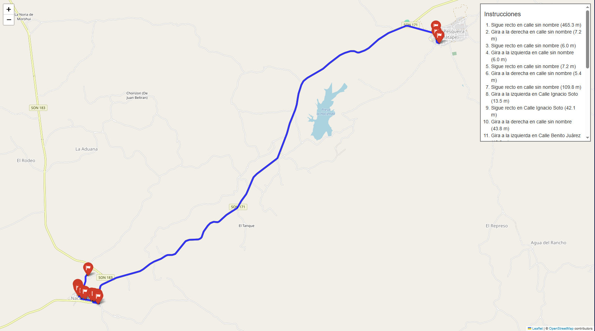

# 🚗 RutaCraftOSM(Calculadora de Rutas con OSM)

RutaCraftOSM es una herramienta basada en Python que permite calcular rutas óptimas entre múltiples puntos GPS utilizando grafos de calles extraídos de OpenStreetMap (OSM). Utiliza algoritmos eficientes de búsqueda (como A*), y genera instrucciones de navegación similares a las de un GPS: giros, distancias y nombres de calles.

✨ Características principales
🧭 Soporta múltiples puntos: origen, paradas intermedias y destino.

📍 Visualización de rutas: sobre mapas interactivos usando Folium + Leaflet.

🧾 Instrucciones tipo GPS: giros, distancias, calles y segmentación de ruta.

📤 Exportación a JSON: ideal para integraciones en aplicaciones externas.

⚙️ Compilación con Nuitka: genera ejecutables .exe eficientes y portables.

Perfecto para sistemas de logística, movilidad, demostraciones educativas o integraciones con herramientas como Electron, React o plataformas web.
---

## Ejemplo de generacion 



## 📁 Estructura del Proyecto

```bash
## 📁 Estructura del Proyecto

├── RutaCraftOSM/              # Código principal
│   ├── cli.py                 # CLI para ejecución desde terminal
│   ├── core.py                # Funciones de lógica de ruta e instrucciones
│   ├── grafo_villa_pesqueira.graphml #grafo generado
│   ├── test_data_generador.json #Archivo pra probar el codigo
│   └── preparar_grafo.py      # Script para generar o limpiar el grafo OSM
│
│
├── Libretas/                  # Visualizaciones, pruebas y archivos auxiliares
│   ├── Libretas_Pruebas_AVP.ipynb
│   ├── resultado_ruta.json
│   └── VillaPesqueira.json
│
├── docs/                      # Archivos para demo web
│   └── visualizacion_ruta.html
│
├── build/                     # Carpeta generada por Nuitka en caso de ser generado el .exe
│   └── cli.dist/cli.exe
│
├── tests/                     # Tests unitarios
│   ├── test_cli.py
│   └── test_cli_errores.py
│
├── .gitignore
└── README.md


```

---

## 🧰 Requisitos

### 🔧 1. Python

- Recomendado: **Python 3.11**
- Descárgalo desde: [python.org](https://www.python.org/downloads/)

### 📦 2. Librerías necesarias

Instala las dependencias con pip:

```bash
pip install osmnx networkx geopy folium matplotlib

pip install nuitka

```

## Compilacion 

```bash
nuitka cli.py --standalone --mingw64 --output-dir=build --include-data-files=grafo_De_La_Zona.graphml=grafo_De_La_Zona.graphml --enable-plugin=tk-inter
```
Esto generará un ejecutable en: build/cli.dist/cli.exe
💡 Nuitka descargará automáticamente MinGW si no lo tienes instalado.


📌 Notas
El archivo .graphml representa el grafo vial generado desde OSM para una región específica.

El sistema calcula la ruta más corta entre nodos usando A* y proporciona instrucciones detalladas tipo GPS.

La visualización en HTML puede integrarse fácilmente con cualquier frontend web.

