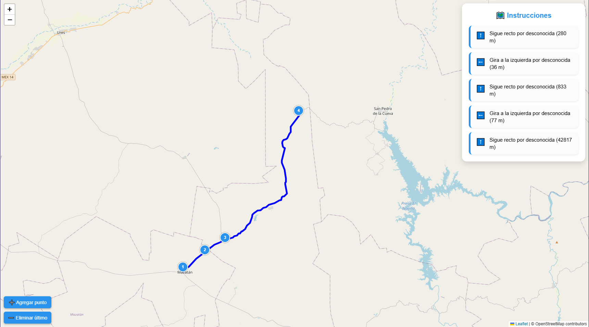

# 🚗 RutaCraftOSM(Calculadora de Rutas con OSM)

RutaCraftOSM es una herramienta basada en Python que permite calcular rutas óptimas entre múltiples puntos GPS utilizando grafos de calles extraídos de OpenStreetMap (OSM). Utiliza algoritmos eficientes de búsqueda (como A*), y genera instrucciones de navegación similares a las de un GPS: giros, distancias y nombres de calles.

## ✨ Características principales

🧭 Soporta múltiples puntos: origen, paradas intermedias y destino.

📍 Visualización de rutas: sobre mapas interactivos usando Folium + Leaflet.

🧾 Instrucciones tipo GPS: giros, distancias, calles y segmentación de ruta.

📤 Exportación a JSON: ideal para integraciones en aplicaciones externas.

⚙️ Compilación con Nuitka: genera ejecutables .exe eficientes y portables.

#### Perfecto para sistemas de logística, movilidad, demostraciones educativas o integraciones con herramientas como Electron, React o plataformas web.
---

## Ejemplo de generacion 



## 📁 Estructura del Proyecto

```bash
## 📁 Estructura del Proyecto

├── Libretas/
│   ├── Libreta_Pruebas_AVP.ipynb
│   └── VillaPesqueira.json   #solo para generar ejemplos
│
├── RutaCraftOSM/           # Código Python para compilación y pruebas
│   ├── tests/
│   ├── cli.py
│   ├── core.py
│   ├── preparar_grafo.py
│   ├── nuikit-crash-report.xml
│   ├── image.png
│   └── README.md
│
├── ruta-craft-osm/         # Paquete npm compilado (EXE y código TS/JS)
│    ├── bin/
│    ├── dist/
│    ├── node_modules/
│    ├── src/
│    │   ├── cache_rutas/   #Solo para pruebas 
│    │   ├── grafos/        #solo para pruebas
│    │   ├── index.ts
│    │   └── test-calcularRuta.cjs
│    ├── package.json
│    ├── package-lock.json
│    └── tsconfig.json
│
├── .gitignore
└── README.md


```

---

## 🧰 Requisitos

### 🔧 1. Python

- Recomendado: **Python 3.11**
- Descárgalo desde: [python.org](https://www.python.org/downloads/)

### 📦 2. Librerías necesarias Python

Instala las dependencias con pip:

```bash
pip install osmnx networkx geopy folium

pip install nuitka #si dea compilar 

```

### 📦 3. Paquete npm local
Solo es necesario ejecutar:
```bash
npm install

```

---

## 🧠 ¿Cómo funciona el codigo?

El archivo preparar_grafo.py descarga zonas desde OSM y genera un archivo .graphml y .pkl.

El archivo .pkl contiene una lista de adyacencia y coordenadas: representación del grafo vial.

Se calculan rutas entre puntos usando A* con la distancia de Haversine como heurística.

Se generan instrucciones de navegación (tipo GPS) como "Gira a la derecha", "Sigue recto", etc.

### La visualización en HTML puede integrarse fácilmente con cualquier frontend web.
---
## Compilacion 

```bash
nuitka cli.py --standalone --mingw64 --output-dir=build --include-data-files=grafo_De_La_Zona.graphml=grafo_De_La_Zona.graphml --enable-plugin=no-qt

```
Esto generará un ejecutable en: build/cli.dist/cli.exe

💡 Nuitka descargará automáticamente MinGW si no lo tienes instalado.

---


# Uso como paquete npm local
### Se puede usar el proyecto como una librería en tus proyectos Node.js (localmente):

Se pude usar como paquete npm local en su computador usando el comando npm link y npm link "ruta-craft-osm"
pasos para esto dirigase a la carpeda ruta-craft-osm/ y en la raiz de la misma ejecute:
```bash
npm link

```
y en el proyecto que desea instalar la libreria ejecute:
```bash
npm link ruta-craft-osm

```
Esto te permitirá usar el wrapper del ejecutable como si fuera una dependencia npm.
