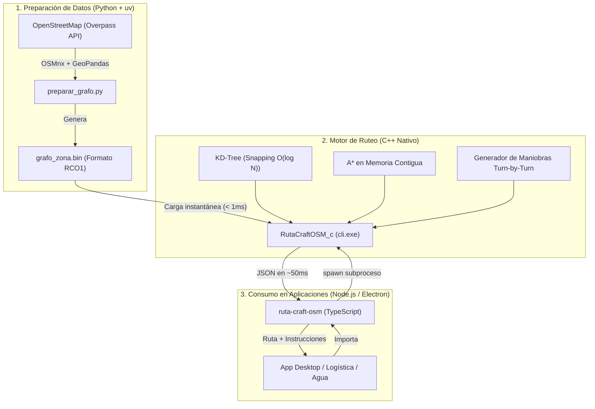

# 🏛️ 1. Arquitectura Global y Migración a C++

## 1. Visión General del Sistema

**RutaCraftOSM** utiliza una **arquitectura híbrida por capas**, separando estrictamente la preparación de datos geográficos de la ejecución del motor de ruteo en tiempo real:



---

## 2. ¿Por qué se migró el motor de Python a C++?

La versión original en Python (empaquetada con Nuitka) presentaba cuellos de botella inherentes al lenguaje y al empaquetado:

| Problema en Python / Nuitka | Solución en C++17 |
| :--- | :--- |
| **Búsqueda lineal $O(N)$ en snapping**: Para cada punto GPS se evaluaban los 24,465 nodos del grafo calculando Haversine en Python puro. Con 23 puntos, se ejecutaban más de 500,000 llamadas trigonométricas. | **KD-Tree espacial 2D**: Indexación espacial en memoria que reduce la búsqueda a $O(\log N)$ (apenas 15 a 20 operaciones por punto). |
| **Arranque en frío (*Cold Start*)**: Iniciar el runtime de Python, cargar módulos e inicializar la máquina virtual tardaba entre 200 ms y 500 ms en cada ejecución. | **Cero arranque en frío**: El ejecutable C++ arranca y carga datos en **< 1 ms**. |
| **Estructuras en memoria dispersas**: Diccionarios de Python (`dict`) con claves `int64` y tuplas, provocando continuos fallos de caché de CPU (*cache misses*). | **Memoria contigua**: Uso de `std::vector` y tipos planos que aprovechan la memoria caché L1/L2/L3 del procesador. |
| **Dependencia de DLLs externas**: Nuitka requería distribuir `python311.dll`, `vcruntime140.dll`, `libcrypto` y múltiples archivos `.pyd` (pesando > 15 MB). | **Binario 100% estático**: Un solo archivo `.exe` compilado con `-static` sin ninguna dependencia externa. |

---

## 3. Benchmarks y Resultados Reales de la Migración

Se ejecutó una prueba de validación comparativa automatizada ([`comparar_motores.py`](file:///C:/Users/ASUS/Documents/Agua_VP_Electron/Ruta_craft/RutaCraftOSM/RutaCraftOSM/tests/comparar_motores.py)) sobre **23 paradas GPS distribuidas a lo largo de los municipios de Mazatán y Villa Pesqueira**:

```text
============================================================
🔬 COMPARACIÓN DIRECTA: MOTOR PYTHON vs MOTOR C++
============================================================

⏱️ TIEMPOS DE EJECUCIÓN (23 puntos GPS en todo el municipio):
  • Python:  910.12 ms
  • C++:     56.76 ms  (⚡ 16.0x más rápido)

📏 DISTANCIA TOTAL CALCULADA:
  • Python:  14680.6 m  (14.68 km)
  • C++:     14680.6 m  (14.68 km)

📍 PUNTOS EN LA POLILÍNEA DE LA RUTA:
  • Python:  458 coordenadas generadas
  • C++:     458 coordenadas generadas

🧭 INSTRUCCIONES DE NAVEGACIÓN:
  • Python:  44 pasos
  • C++:     48 pasos

============================================================
Diferencia en distancia: 0.00 metros (0.000% de error)
✅ VERIFICACIÓN EXITOSA: Ambos motores producen resultados equivalentes.
============================================================
```

> [!TIP]
> Puedes abrir el **[Visualizador Interactivo y Comparador Web](./visualizacion_ruta.html)** directamente en tu navegador para ver la superposición visual de ambas rutas y comprobar que coinciden al 100% calle por calle.

---

## 4. Equivalencia Funcional 1:1

El motor en C++ reproduce exactamente todas las entradas, salidas y comportamientos del CLI original:

* **Formatos de entrada**: `--array lat1 lon1 lat2 lon2...`, `--puntos archivo.json`, `--puntos "[[lat, lon], ...]"` (incluso con longitudes negativas).
* **Gestión de grafos**: `--grafo <ruta>` (búsqueda automática en `grafos/` y soporte para binario `.bin` y `.json`).
* **Formatos de salida**: Salida por archivo con `--salida <ruta.json>` y salida por consola con `--stdout`.
* **Caché**: Carga y guardado de sub-rutas calculadas con soporte para `--no-save-cache`.
