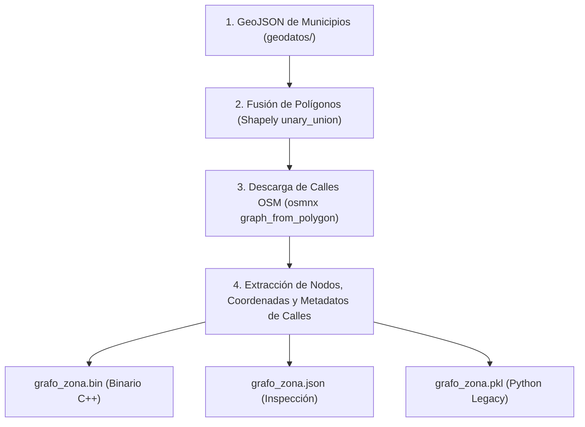

# 🐍 2. Pipeline de Datos en Python con `uv`

## 1. Gestión del Entorno con `uv`

Para la preparación de datos geográficos y las libretas de experimentación, se utiliza **`uv`**, el gestor de paquetes y entornos virtuales de Python de alta velocidad.

### Instalación y Creación del Entorno
```powershell
# Ubicarse en la carpeta Python
cd RutaCraftOSM

# Crear entorno virtual .venv
uv venv .venv

# Instalar dependencias científicas y de mapas
uv pip install osmnx geopandas shapely networkx ipykernel
```

### Ejecución de Scripts con `uv run`
Con `uv run`, los comandos se ejecutan automáticamente dentro del entorno virtual sin necesidad de activarlo manualmente:
```powershell
uv run python preparar_grafo.py
uv run python -m unittest discover -s tests -p "test_*.py"
```

---

## 2. Funcionamiento de `preparar_grafo.py`

El script [`preparar_grafo.py`](file:///C:/Users/ASUS/Documents/Agua_VP_Electron/Ruta_craft/RutaCraftOSM/RutaCraftOSM/preparar_grafo.py) automatiza la extracción de las redes viales desde OpenStreetMap:



### Paso a paso del procesamiento:
1. **Carga y unión de polígonos**: Lee los límites de los municipios (ej. Mazatán y Villa Pesqueira) y los une en una sola geometría continua.
2. **Descarga de la red vial**: Descarga las calles de tipo `network_type="drive"` (apto para vehículos) respetando la topología real de las intersecciones (`simplify=False`).
3. **Extracción de atributos viales**:
   - `y`, `x`: Latitud y longitud exactas de cada nodo.
   - `length`: Longitud en metros de cada tramo vial.
   - `name`: Nombre de la calle (ej. *"Calle Hidalgo"* o *"Carretera Estatal 15"*).
   - `highway`: Categoría OSM de la vía (`residential`, `primary`, `secondary`, etc.).

---

## 3. Formatos de Salida Generados

Al ejecutarse, `preparar_grafo.py` genera tres archivos en la carpeta `grafos/`:

| Archivo | Formato | Propósito | Tiempo de Carga |
| :--- | :--- | :--- | :---: |
| `grafo_mazatan_villapesqueira.bin` | **Binario RCO1** | Consumo directo por el motor C++ | **< 1 ms** |
| `grafo_mazatan_villapesqueira.json` | **JSON** | Inspección humana, debugging y frontend | ~80 ms |
| `grafo_mazatan_villapesqueira.pkl` | **Pickle** | Compatibilidad con scripts y tests de Python | ~120 ms |

---

## 4. Pruebas Unitarias de Python

Para verificar que el pipeline de Python funciona correctamente, se dispone de una suite de pruebas en `RutaCraftOSM/tests/`:

```powershell
uv run python -m unittest discover -s tests -p "test_*.py"
```

* [`test_cli.py`](file:///C:/Users/ASUS/Documents/Agua_VP_Electron/Ruta_craft/RutaCraftOSM/RutaCraftOSM/tests/test_cli.py): Prueba entradas por `--array`, `--puntos` (archivo y JSON string) y exportación a `--salida`.
* [`test_cli_errores.py`](file:///C:/Users/ASUS/Documents/Agua_VP_Electron/Ruta_craft/RutaCraftOSM/RutaCraftOSM/tests/test_cli_errores.py): Prueba manejo de errores (JSON malformado, número impar de coordenadas, falta de argumentos).
