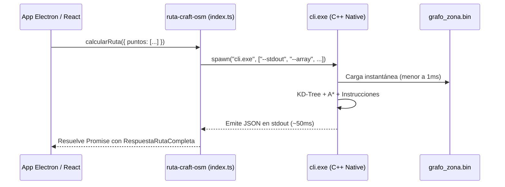

# 📦 4. Integración TypeScript y Electron (`ruta-craft-osm`)

El paquete **`ruta-craft-osm`** es el puente (*wrapper*) tipado en TypeScript para consumir el motor de ruteo nativo desde Node.js, Electron o aplicaciones frontend de escritorio.

---

## 1. ¿Cómo funciona la comunicación?

La librería interactúa con el binario nativo compilado mediante el módulo estándar `child_process.spawn`:



---

## 2. Detección Automática de Entorno (Electron vs Node)

En [`src/index.ts`](file:///C:/Users/ASUS/Documents/Agua_VP_Electron/Ruta_craft/RutaCraftOSM/ruta-craft-osm/src/index.ts), la función `getCliExePath()` detecta si la aplicación está empaquetada con Electron en producción (`app.asar`):

```typescript
function isPackaged(): boolean {
    return process.mainModule?.filename.includes('app.asar') ?? false;
}

function getCliExePath(): string {
    const isWindows = process.platform === "win32";
    const binaryName = isWindows ? "cli.exe" : "cli";

    if (isPackaged()) {
        const resourcesPath = (process as any).resourcesPath;
        return path.join(
            resourcesPath,
            "app.asar.unpacked",
            "node_modules",
            "ruta-craft-osm",
            "bin",
            "cli",
            binaryName
        );
    } else {
        return path.join(__dirname, "..", "bin", "cli", binaryName);
    }
}
```

> [!IMPORTANT]
> Al empaquetar con `electron-builder` o `electron-forge`, asegúrate de incluir en tu configuración `asarUnpack: ["**/node_modules/ruta-craft-osm/bin/**"]` para que el ejecutable `cli.exe` y el archivo `grafo.bin` queden fuera del archivo comprimido `.asar`.

---

## 3. Tipos e Interfaces de TypeScript

```typescript
export interface CalcularRutaOptions {
    puntos: [number, number][]; // Array de coordenadas [latitud, longitud]
    grafo?: string;             // Ruta al archivo de grafo .bin o .json
    cachePath?: string;         // Ruta para leer/guardar caché
    saveCache?: boolean;        // Si es false, no guarda el caché en disco
}

export interface InstruccionNavegacion {
    accion: string;             // "Sigue recto", "Gira a la derecha", etc.
    calle: string;              // Nombre de la calle de OSM
    desde: [number, number];    // Coordenada inicial del tramo
    hacia: [number, number];    // Coordenada final del tramo
    distancia_m: number;        // Distancia del tramo en metros
}

export interface ResultadoRuta {
    puntos_gps: [number, number][];
    ruta: [number, number][];   // Polilínea completa de la ruta
    distancia_total_m: number;  // Distancia acumulada en metros
    distancia_total_km: number; // Distancia en kilómetros
    instrucciones: InstruccionNavegacion[];
}

export interface RespuestaRutaCompleta {
    resultado: ResultadoRuta;
    cache?: Record<string, string[]>;
}
```

---

## 4. Instalación Local y Uso en Proyectos

### Paso 1: Compilar y enlazar el paquete localmente
```powershell
# 1. Ubicarse en la carpeta del paquete
cd ruta-craft-osm

# 2. Compilar TypeScript
npm run build

# 3. Registrar enlace global de npm
npm link
```

### Paso 2: Usar en tu proyecto de Electron / Node.js
```powershell
# En la raíz de tu proyecto Electron
npm link ruta-craft-osm
```

### Paso 3: Ejemplo de código en JavaScript / TypeScript
```javascript
const { calcularRuta } = require('ruta-craft-osm');

async function obtenerRutaLecturas() {
  try {
    const respuesta = await calcularRuta({
      puntos: [
        [29.065639, -110.056448], // Inicio (Punto 1)
        [29.062039, -110.059091], // Medidor 2
        [29.059486, -110.053973], // Medidor 3
        [29.118091, -109.970340]  // Destino final
      ],
      cachePath: './cache_rutas.json',
      saveCache: true
    });

    const { ruta, distancia_total_km, instrucciones } = respuesta.resultado;

    console.log(`Distancia Total: ${distancia_total_km} km`);
    console.log(`Coordenadas en el trazado: ${ruta.length}`);

    instrucciones.forEach((inst, i) => {
      console.log(`${i + 1}. ${inst.accion} en ${inst.calle} (${inst.distancia_m} m)`);
    });

    return ruta;
  } catch (error) {
    console.error("Error al calcular ruta:", error);
  }
}
```
